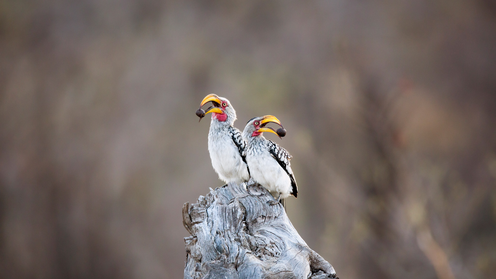
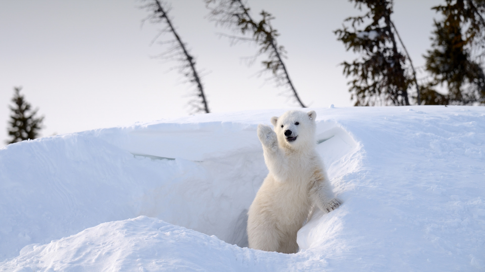
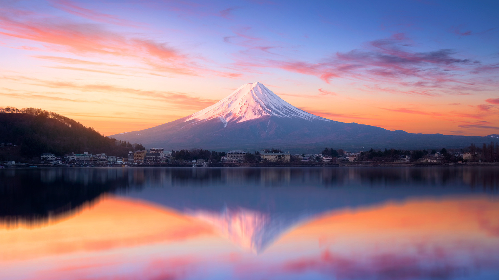
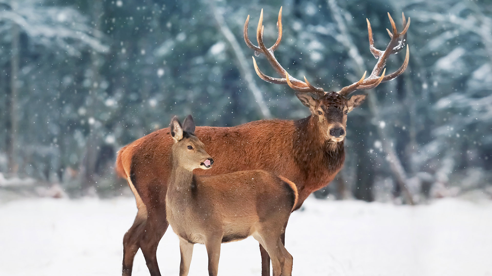
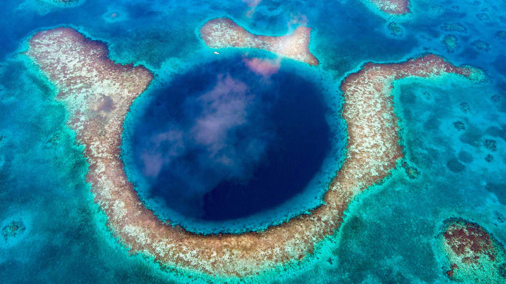

# Bing Wallpaper

```
Python 每日爬取Bing壁纸，保存到本地，同时将最近30天的图片链接写入README.md
从2009年开始至今的图片大部分都有，有几个实在是找不到了
```


## 今日图片


2025/03/19 [download](./images/2025/03/19/BlackHeron_ZH-CN6764711050_1920x1080_2025-03-19.jpg)

## 最近30天的图片链接


|      |      |      |
| :----: | :----: | :----: |
|2025/03/19 [download](./images/2025/03/19/BlackHeron_ZH-CN6764711050_1920x1080_2025-03-19.jpg)|2025/03/18 [download](./images/2025/03/18/SedonaSpring_ZH-CN6305197600_1920x1080_2025-03-18.jpg)|2025/03/17 [download](./images/2025/03/17/BeckettBridge_ZH-CN6206942429_1920x1080_2025-03-17.jpg)|
|2025/03/16 [download](./images/2025/03/16/PandaSnow_ZH-CN5981854301_1920x1080_2025-03-16.jpg)|2025/03/15 [download](./images/2025/03/15/ForumRomanum_ZH-CN5873120178_1920x1080_2025-03-15.jpg)|2025/03/14 [download](./images/2025/03/14/BasqueDolmen_ZH-CN2364777801_1920x1080_2025-03-14.jpg)|
|2025/03/13 [download](./images/2025/03/13/HoliColors_ZH-CN2177185823_1920x1080_2025-03-13.jpg)|2025/03/12 [download](./images/2025/03/12/ChateauLoire_ZH-CN5040147638_1920x1080_2025-03-12.jpg)|2025/03/11 [download](./images/2025/03/11/NusaPenida_ZH-CN4934656933_1920x1080_2025-03-11.jpg)|
|2025/03/10 [download](./images/2025/03/10/NappingLion_ZH-CN1214312983_1920x1080_2025-03-10.jpg)|2025/03/09 [download](./images/2025/03/09/ItalyClock_ZH-CN0846995743_1920x1080_2025-03-09.jpg)|2025/03/08 [download](./images/2025/03/08/WaddenSeaBiosphereReserve_ZH-CN9012125146_1920x1080_2025-03-08.jpg)|
|2025/03/07 [download](./images/2025/03/07/PlumBlossom_ZH-CN5888621119_1920x1080_2025-03-07.jpg)|2025/03/06 [download](./images/2025/03/06/NevadaBigHorns_ZH-CN5987046965_1920x1080_2025-03-06.jpg)|2025/03/05 [download](./images/2025/03/05/SuratThani_ZH-CN4797096558_1920x1080_2025-03-05.jpg)|
|2025/03/04 [download](./images/2025/03/04/MardiGrasJackson_ZH-CN3456301377_1920x1080_2025-03-04.jpg)|2025/03/03 [download](./images/2025/03/03/HornbillPair_ZH-CN3380997666_1920x1080_2025-03-03.jpg)|2025/03/02 [download](./images/2025/03/02/EucalyptusForest_ZH-CN3052498076_1920x1080_2025-03-02.jpg)|
|2025/03/01 [download](./images/2025/03/01/MaligneLakeJasper_ZH-CN2664289451_1920x1080_2025-03-01.jpg)|2025/02/28 [download](./images/2025/02/28/BhutanMonastery_ZH-CN2469401011_1920x1080_2025-02-28.jpg)|2025/02/27 [download](./images/2025/02/27/PolarCub_ZH-CN1179361319_1920x1080_2025-02-27.jpg)|
|2025/02/26 [download](./images/2025/02/26/ArgyllStalker_ZH-CN0970395078_1920x1080_2025-02-26.jpg)|2025/02/25 [download](./images/2025/02/25/BryceHoodoos_ZH-CN0817211446_1920x1080_2025-02-25.jpg)|2025/02/24 [download](./images/2025/02/24/GiantCuttlefish_ZH-CN0670915878_1920x1080_2025-02-24.jpg)|
|2025/02/23 [download](./images/2025/02/23/MtFujiSunrise_ZH-CN0567499176_1920x1080_2025-02-23.jpg)|2025/02/22 [download](./images/2025/02/22/StLouisArch_ZH-CN0442955735_1920x1080_2025-02-22.jpg)|2025/02/21 [download](./images/2025/02/21/ChampakaSarasi_ZH-CN0254940579_1920x1080_2025-02-21.jpg)|
|2025/02/20 [download](./images/2025/02/20/CanadaDeer_ZH-CN0631345798_1920x1080_2025-02-20.jpg)|2025/02/19 [download](./images/2025/02/19/IceHoleOtter_ZH-CN0106321041_1920x1080_2025-02-19.jpg)|2025/02/18 [download](./images/2025/02/18/BlueBelize_ZH-CN9875040666_1920x1080_2025-02-18.jpg)|


