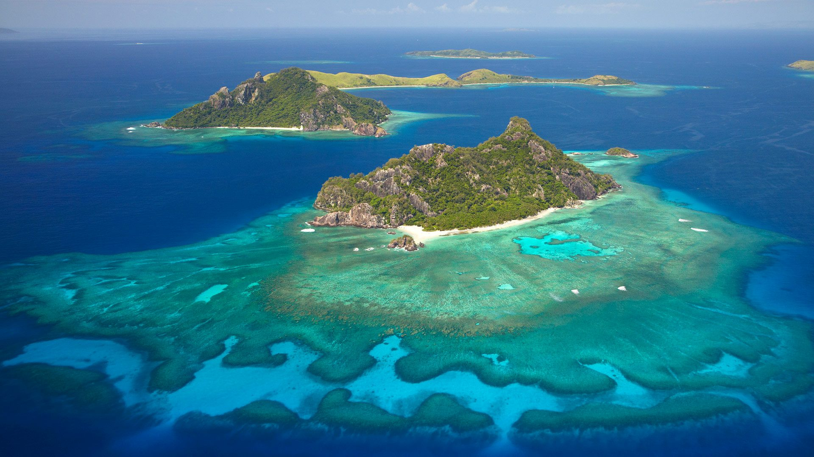
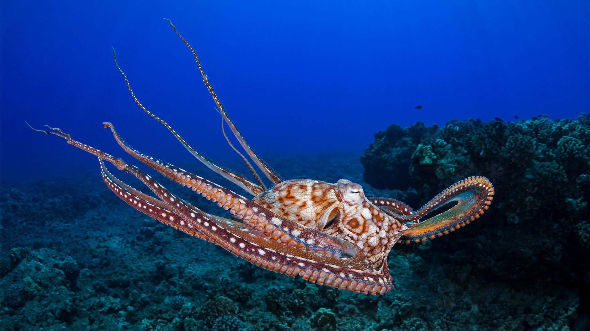
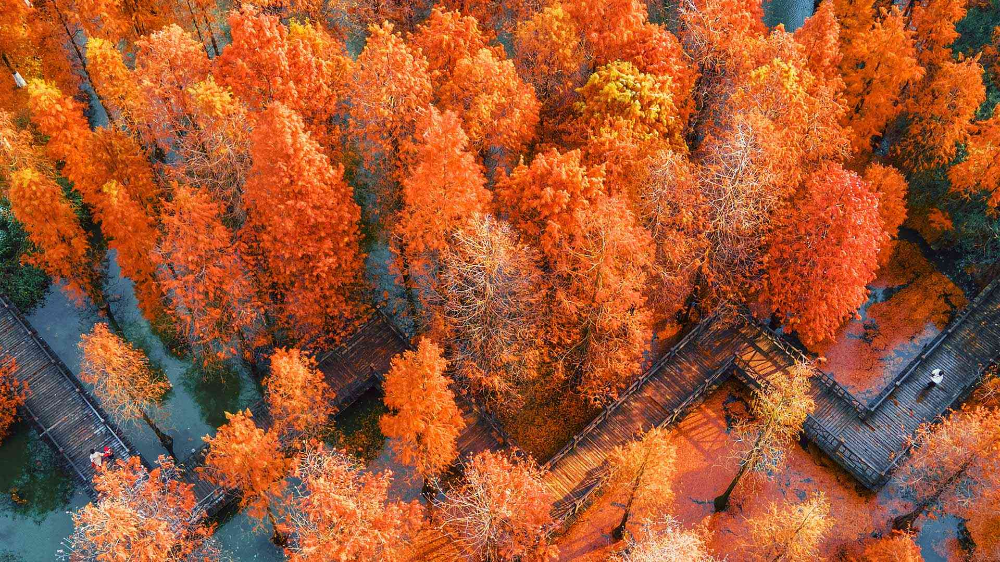
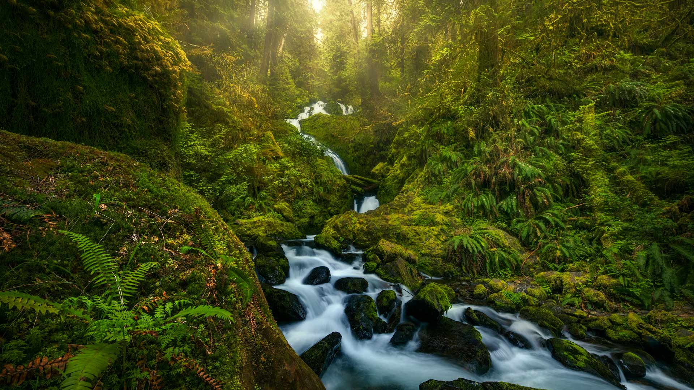
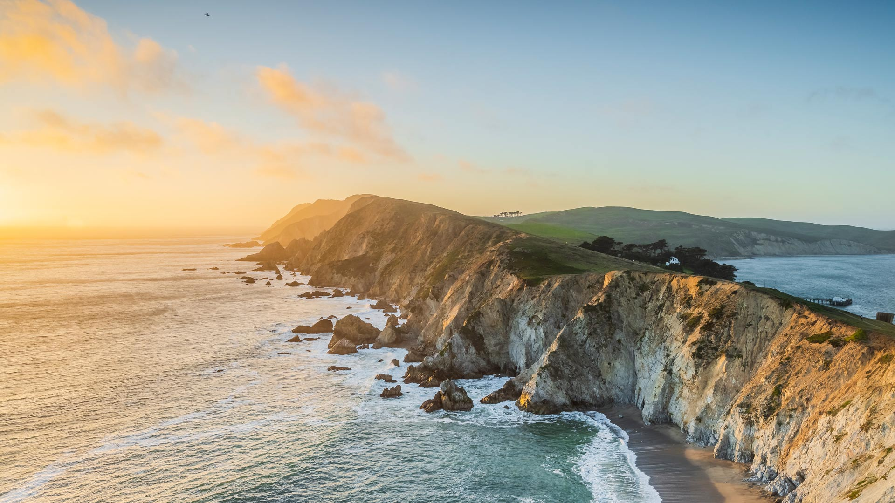
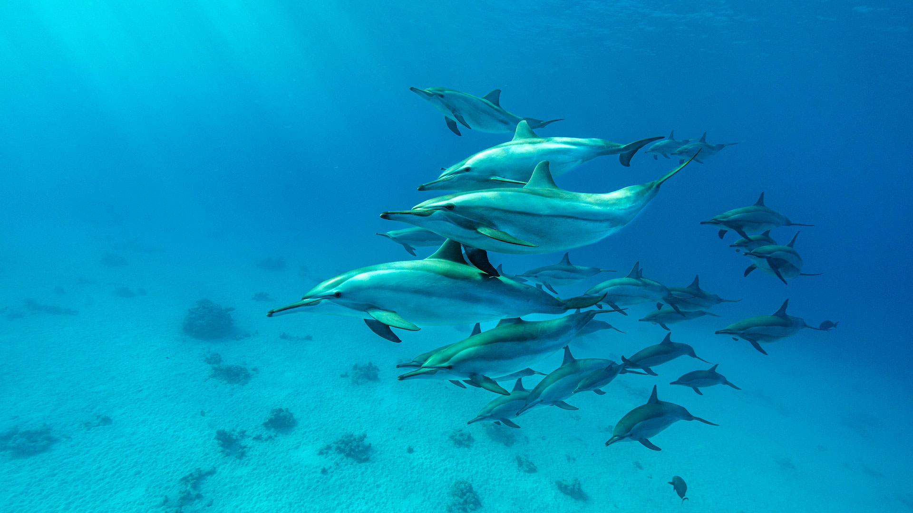

# Bing Wallpaper

```
Python 每日爬取Bing壁纸，保存到本地，同时将最近30天的图片链接写入README.md
从2009年开始至今的图片大部分都有，有几个实在是找不到了
```


## 今日图片


2025/10/10 [download](./images/2025/10/10/MonurikiFiji_ZH-CN9178115886_1920x1080_2025-10-10.jpg)

## 最近30天的图片链接


|      |      |      |
| :----: | :----: | :----: |
|2025/10/10 [download](./images/2025/10/10/MonurikiFiji_ZH-CN9178115886_1920x1080_2025-10-10.jpg)|2025/10/09 [download](./images/2025/10/09/WebbPillars_ZH-CN9054137596_1920x1080_2025-10-09.jpg)|2025/10/08 [download](./images/2025/10/08/OctopusCyanea_ZH-CN8948609460_1920x1080_2025-10-08.jpg)|
|2025/10/07 [download](./images/2025/10/07/RidgwayAspens_ZH-CN8735375502_1920x1080_2025-10-07.jpg)|2025/10/06 [download](./images/2025/10/06/AnshunBridge_ZH-CN8392458102_1920x1080_2025-10-06.jpg)|2025/10/05 [download](./images/2025/10/05/TeacherOwl_ZH-CN8289875605_1920x1080_2025-10-05.jpg)|
|2025/10/04 [download](./images/2025/10/04/DragonEndeavour_ZH-CN8160066040_1920x1080_2025-10-04.jpg)|2025/10/03 [download](./images/2025/10/03/SkyeHeather_ZH-CN2820283990_1920x1080_2025-10-03.jpg)|2025/10/02 [download](./images/2025/10/02/OxbowBend_ZH-CN7211791969_1920x1080_2025-10-02.jpg)|
|2025/10/01 [download](./images/2025/10/01/YosemiteClark_ZH-CN7179533292_1920x1080_2025-10-01.jpg)|2025/09/30 [download](./images/2025/09/30/EucalyptusKoala_ZH-CN6942451940_1920x1080_2025-09-30.jpg)|2025/09/29 [download](./images/2025/09/29/HoutenHouses_ZH-CN6776452438_1920x1080_2025-09-29.jpg)|
|2025/09/28 [download](./images/2025/09/28/PienzaItaly_ZH-CN6564335348_1920x1080_2025-09-28.jpg)|2025/09/27 [download](./images/2025/09/27/TankLakes_ZH-CN6402368934_1920x1080_2025-09-27.jpg)|2025/09/26 [download](./images/2025/09/26/AutumnChipmunk_ZH-CN6224482683_1920x1080_2025-09-26.jpg)|
|2025/09/25 [download](./images/2025/09/25/FortChittorgarh_ZH-CN5999553283_1920x1080_2025-09-25.jpg)|2025/09/24 [download](./images/2025/09/24/BearLodge_ZH-CN5880511888_1920x1080_2025-09-24.jpg)|2025/09/23 [download](./images/2025/09/23/AutumnalEquinoxY25_ZH-CN5692548297_1920x1080_2025-09-23.jpg)|
|2025/09/22 [download](./images/2025/09/22/AspenEquinox_ZH-CN5474695693_1920x1080_2025-09-22.jpg)|2025/09/21 [download](./images/2025/09/21/IceOtters_ZH-CN5393791969_1920x1080_2025-09-21.jpg)|2025/09/20 [download](./images/2025/09/20/OktoberfestSwing_ZH-CN5270146600_1920x1080_2025-09-20.jpg)|
|2025/09/19 [download](./images/2025/09/19/ThousandIslands_ZH-CN3197750437_1920x1080_2025-09-19.jpg)|2025/09/18 [download](./images/2025/09/18/DunquinIreland_ZH-CN1418844818_1920x1080_2025-09-18.jpg)|2025/09/17 [download](./images/2025/09/17/YoungMoose_ZH-CN4639410217_1920x1080_2025-09-17.jpg)|
|2025/09/16 [download](./images/2025/09/16/OzoneEarth_ZH-CN0993915980_1920x1080_2025-09-16.jpg)|2025/09/15 [download](./images/2025/09/15/Echasse_ZH-CN0670369582_1920x1080_2025-09-15.jpg)|2025/09/14 [download](./images/2025/09/14/HohWaterfall_ZH-CN0297269806_1920x1080_2025-09-14.jpg)|
|2025/09/13 [download](./images/2025/09/13/PointReyesSeashore_ZH-CN0076789582_1920x1080_2025-09-13.jpg)|2025/09/12 [download](./images/2025/09/12/SpinnerDolphins_ZH-CN9731341241_1920x1080_2025-09-12.jpg)|2025/09/11 [download](./images/2025/09/11/ExtremaduraJamon_ZH-CN1559355133_1920x1080_2025-09-11.jpg)|


