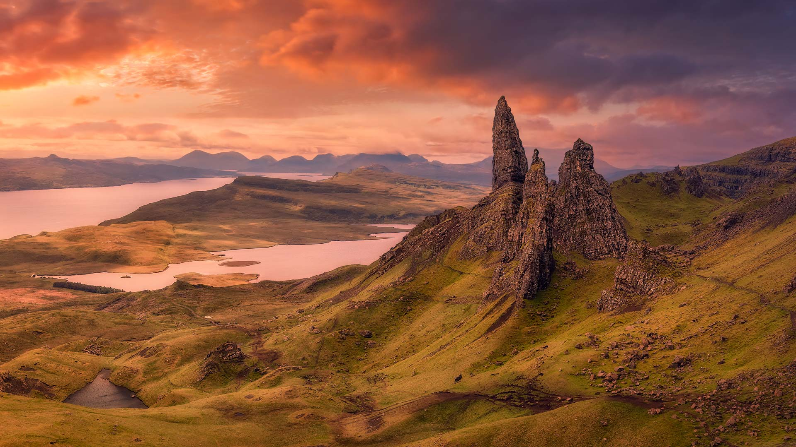
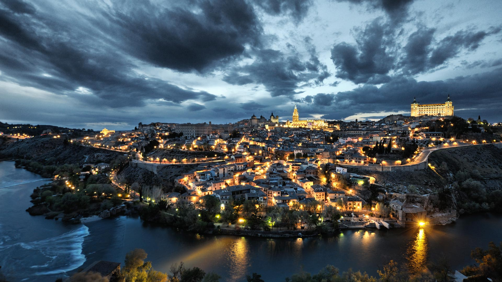
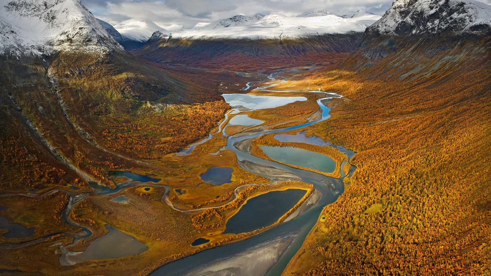
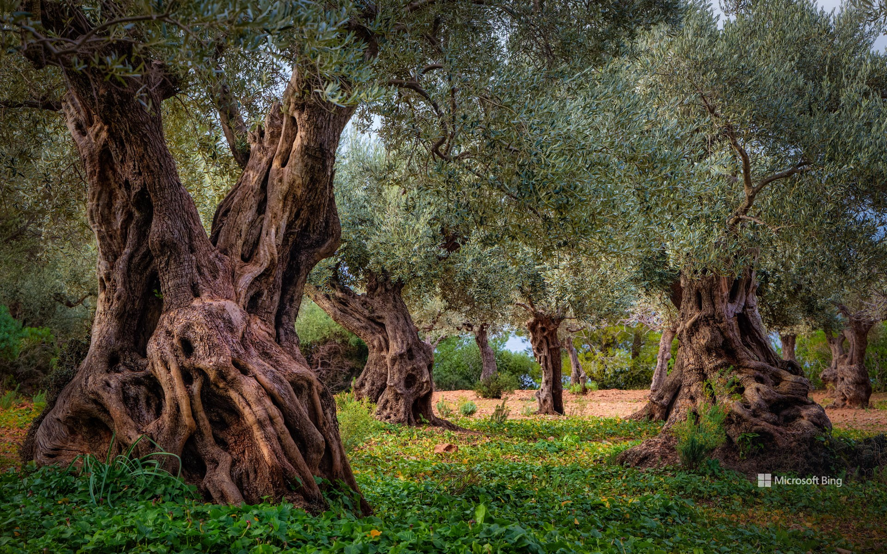

# Bing Wallpaper

```
Python 每日爬取Bing壁纸，保存到本地，同时将最近30天的图片链接写入README.md
从2009年开始至今的图片大部分都有，有几个实在是找不到了
```


## 今日图片


2023/12/12 [download](./images/2023/12/12/Poinsettia_ZH-CN7255902344_1920x1080_2023-12-12.jpg)

## 最近30天的图片链接


|      |      |      |
| :----: | :----: | :----: |
|2023/12/12 [download](./images/2023/12/12/Poinsettia_ZH-CN7255902344_1920x1080_2023-12-12.jpg)|2023/12/11 [download](./images/2023/12/11/MountainDayChina_ZH-CN6894169616_1920x1080_2023-12-11.jpg)|2023/12/10 [download](./images/2023/12/10/LlanberisSnowdoniaSunset_ZH-CN6682238671_1920x1080_2023-12-10.jpg)|
|2023/12/09 [download](./images/2023/12/09/PatagoniaGuanaco_ZH-CN6438038982_1920x1080_2023-12-09.jpg)|2023/12/08 [download](./images/2023/12/08/JerseyIsland_ZH-CN6224973235_1920x1080_2023-12-08.jpg)|2023/12/07 [download](./images/2023/12/07/GrandCanyonVerdon_ZH-CN6025902720_1920x1080_2023-12-07.jpg)|
|2023/12/06 [download](./images/2023/12/06/DardagnaWaterfalls_ZH-CN5613123621_1920x1080_2023-12-06.jpg)|2023/12/05 [download](./images/2023/12/05/AlpsCastles_ZH-CN5078013932_1920x1080_2023-12-05.jpg)|2023/12/04 [download](./images/2023/12/04/CheetahDay_ZH-CN5114530695_1920x1080_2023-12-04.jpg)|
|2023/12/03 [download](./images/2023/12/03/VermilionCliffs_ZH-CN3945784250_1920x1080_2023-12-03.jpg)|2023/12/02 [download](./images/2023/12/02/GwaliorFortMP_ZH-CN3300432281_1920x1080_2023-12-02.jpg)|2023/12/01 [download](./images/2023/12/01/IcebergAntarctica_ZH-CN2053356825_1920x1080_2023-12-01.jpg)|
|2023/11/30 [download](./images/2023/11/30/TrotternishStorr_ZH-CN2508882441_1920x1080_2023-11-30.jpg)|2023/11/29 [download](./images/2023/11/29/SchwerinerSchloss_ZH-CN2390476345_1920x1080_2023-11-29.jpg)|2023/11/28 [download](./images/2023/11/28/AssiniboineProvincialPark_ZH-CN2270275151_1920x1080_2023-11-28.jpg)|
|2023/11/27 [download](./images/2023/11/27/RioNegro_ZH-CN2121977810_1920x1080_2023-11-27.jpg)|2023/11/26 [download](./images/2023/11/26/BradgateFallow_ZH-CN1852334581_1920x1080_2023-11-26.jpg)|2023/11/25 [download](./images/2023/11/25/TajoRiver_ZH-CN1752559204_1920x1080_2023-11-25.jpg)|
|2023/11/24 [download](./images/2023/11/24/HallofMosses_ZH-CN1565129809_1920x1080_2023-11-24.jpg)|2023/11/23 [download](./images/2023/11/23/TeideNational_ZH-CN1367200520_1920x1080_2023-11-23.jpg)|2023/11/22 [download](./images/2023/11/22/SnakeRiverTeton_ZH-CN1213535303_1920x1080_2023-11-22.jpg)|
|2023/11/21 [download](./images/2023/11/21/HelloSeal_ZH-CN1064568368_1920x1080_2023-11-21.jpg)|2023/11/20 [download](./images/2023/11/20/CastleCoch_ZH-CN0917284602_1920x1080_2023-11-20.jpg)|2023/11/19 [download](./images/2023/11/19/FrozenBog_ZH-CN0712859386_1920x1080_2023-11-19.jpg)|
|2023/11/18 [download](./images/2023/11/18/MilsePolarBear_ZH-CN0567475122_1920x1080_2023-11-18.jpg)|2023/11/17 [download](./images/2023/11/17/BadRiver_ZH-CN0416550169_1920x1080_2023-11-17.jpg)|2023/11/16 [download](./images/2023/11/16/AthensAcropolis_ZH-CN9942357439_1920x1080_2023-11-16.jpg)|
|2023/11/15 [download](./images/2023/11/15/SarekSweden_ZH-CN9728518595_1920x1080_2023-11-15.jpg)|2023/11/14 [download](./images/2023/11/14/RussellLupines_ZH-CN8552113285_1920x1080_2023-11-14.jpg)|2023/11/13 [download](./images/2023/11/13/OliveOrchard_ZH-CN8198989130_1920x1080_2023-11-13.jpg)|


