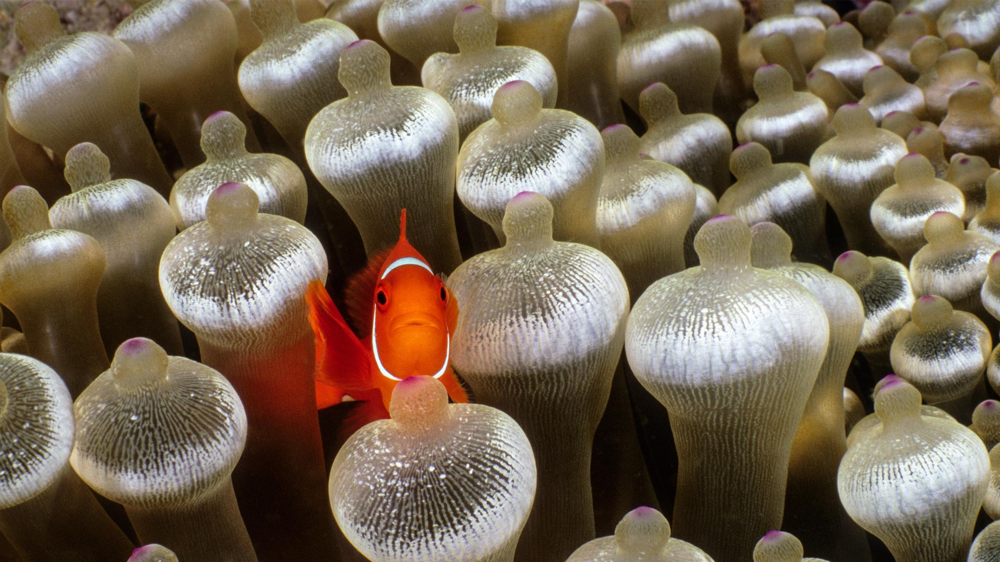
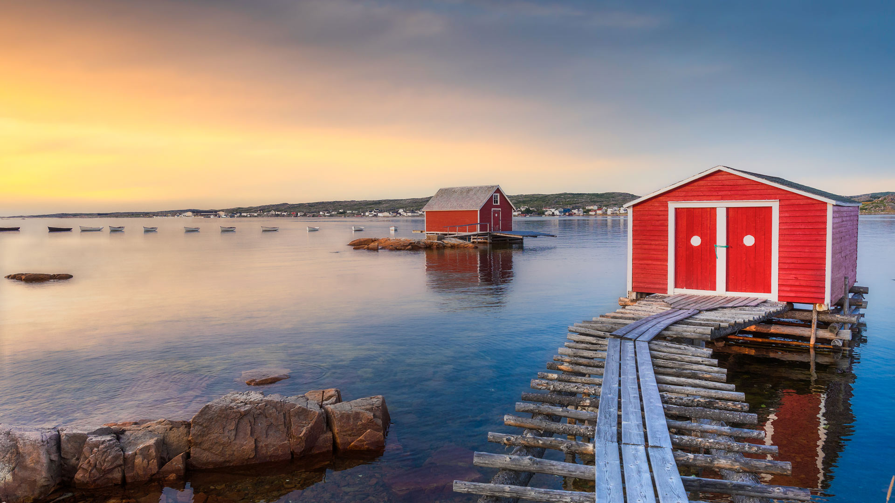
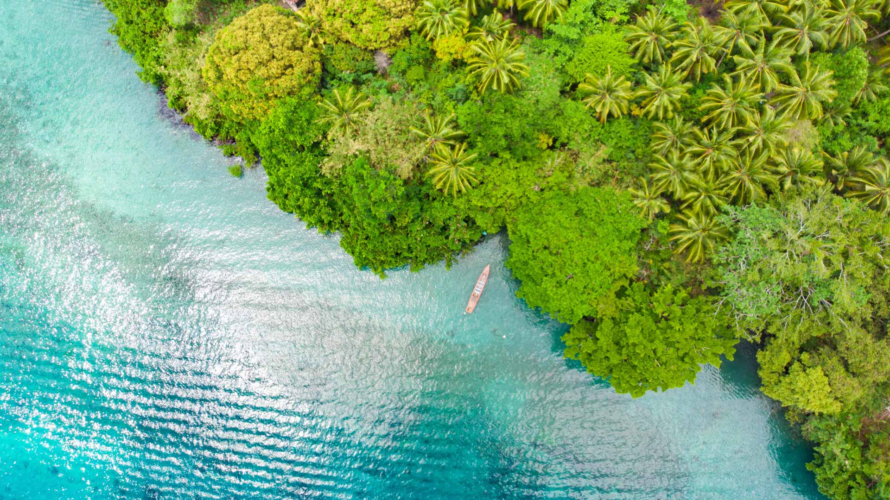
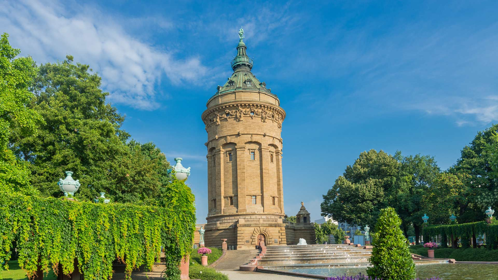
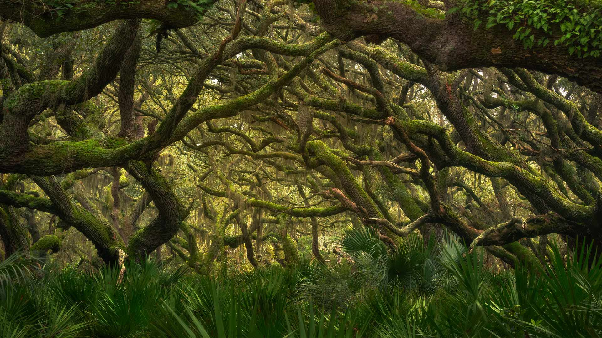
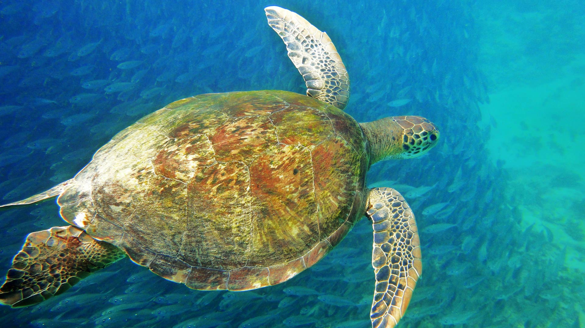
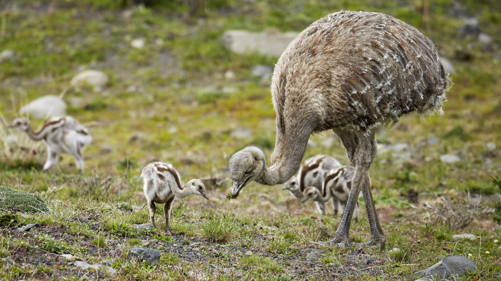

# Bing Wallpaper

```
Python 每日爬取Bing壁纸，保存到本地，同时将最近30天的图片链接写入README.md
从2009年开始至今的图片大部分都有，有几个实在是找不到了
```


## 今日图片


2025/07/11 [download](./images/2025/07/11/TokyoSunrise_ZH-CN0091906710_1920x1080_2025-07-11.jpg)

## 最近30天的图片链接


|      |      |      |
| :----: | :----: | :----: |
|2025/07/11 [download](./images/2025/07/11/TokyoSunrise_ZH-CN0091906710_1920x1080_2025-07-11.jpg)|2025/07/10 [download](./images/2025/07/10/BahamaBlues_ZH-CN8134624828_1920x1080_2025-07-10.jpg)|2025/07/09 [download](./images/2025/07/09/ConstitucionStation_ZH-CN7962568053_1920x1080_2025-07-09.jpg)|
|2025/07/08 [download](./images/2025/07/08/SecedaPeak_ZH-CN7633793128_1920x1080_2025-07-08.jpg)|2025/07/07 [download](./images/2025/07/07/ShetlandGannets_ZH-CN7279521125_1920x1080_2025-07-07.jpg)|2025/07/06 [download](./images/2025/07/06/MesquiteFlats_ZH-CN7152959188_1920x1080_2025-07-06.jpg)|
|2025/07/05 [download](./images/2025/07/05/BolozonViaduct_ZH-CN6408632524_1920x1080_2025-07-05.jpg)|2025/07/04 [download](./images/2025/07/04/OroseiSardegna_ZH-CN5789138034_1920x1080_2025-07-04.jpg)|2025/07/03 [download](./images/2025/07/03/RainbowRiver_ZH-CN5320095849_1920x1080_2025-07-03.jpg)|
|2025/07/02 [download](./images/2025/07/02/MaroonClownfish_ZH-CN5071934692_1920x1080_2025-07-02.jpg)|2025/07/01 [download](./images/2025/07/01/CanadaDayFogo_ZH-CN2593963748_1920x1080_2025-07-01.jpg)|2025/06/30 [download](./images/2025/06/30/WolfeCrater_ZH-CN1652906326_1920x1080_2025-06-30.jpg)|
|2025/06/29 [download](./images/2025/06/29/BandaIsland_ZH-CN1145779264_1920x1080_2025-06-29.jpg)|2025/06/28 [download](./images/2025/06/28/WatertowerMannheim_ZH-CN0692039329_1920x1080_2025-06-28.jpg)|2025/06/27 [download](./images/2025/06/27/SwedenReserve_ZH-CN9963744170_1920x1080_2025-06-27.jpg)|
|2025/06/26 [download](./images/2025/06/26/HorseheadRock_ZH-CN9319651125_1920x1080_2025-06-26.jpg)|2025/06/25 [download](./images/2025/06/25/GlastonburyScenic_ZH-CN9162571249_1920x1080_2025-06-25.jpg)|2025/06/24 [download](./images/2025/06/24/DelicateArch_ZH-CN8971667580_1920x1080_2025-06-24.jpg)|
|2025/06/23 [download](./images/2025/06/23/DresdenElbe_ZH-CN8776977800_1920x1080_2025-06-23.jpg)|2025/06/22 [download](./images/2025/06/22/AmazonEcuador_ZH-CN2864991745_1920x1080_2025-06-22.jpg)|2025/06/21 [download](./images/2025/06/21/SummerSolsticeY25_ZH-CN2728972774_1920x1080_2025-06-21.jpg)|
|2025/06/20 [download](./images/2025/06/20/SerengetiGiraffe_ZH-CN2613013393_1920x1080_2025-06-20.jpg)|2025/06/19 [download](./images/2025/06/19/WinterBegins_ZH-CN7638411804_1920x1080_2025-06-19.jpg)|2025/06/18 [download](./images/2025/06/18/AsianSwallowtail_ZH-CN7442263508_1920x1080_2025-06-18.jpg)|
|2025/06/17 [download](./images/2025/06/17/CumberlandOaks_ZH-CN7265906780_1920x1080_2025-06-17.jpg)|2025/06/16 [download](./images/2025/06/16/SeaTurtleBrazil_ZH-CN6907161064_1920x1080_2025-06-16.jpg)|2025/06/15 [download](./images/2025/06/15/RheaDad_ZH-CN6706868651_1920x1080_2025-06-15.jpg)|
|2025/06/14 [download](./images/2025/06/14/DolomitiEstate_ZH-CN6501271709_1920x1080_2025-06-14.jpg)|2025/06/13 [download](./images/2025/06/13/SanMiguelAzores_ZH-CN2511982585_1920x1080_2025-06-13.jpg)|2025/06/12 [download](./images/2025/06/12/BigBendChisos_ZH-CN3794880768_1920x1080_2025-06-12.jpg)|


