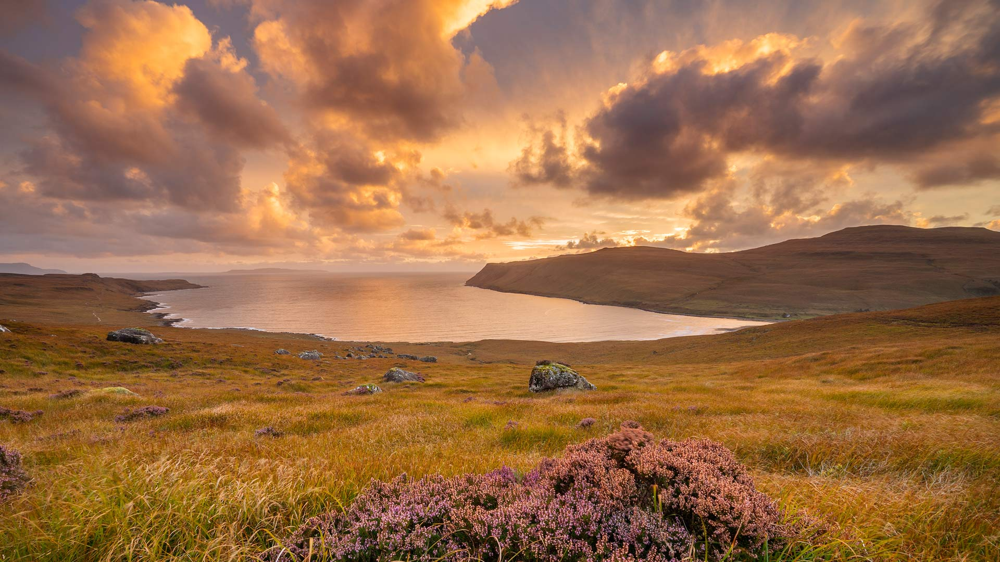
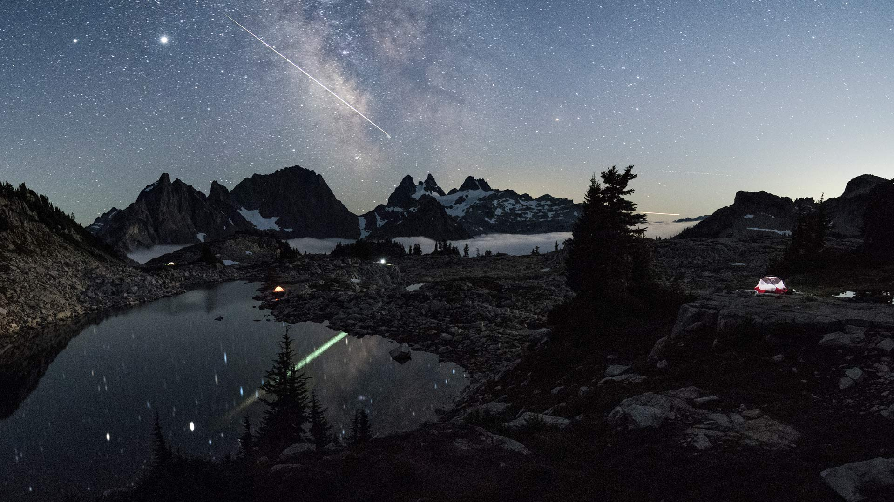

# Bing Wallpaper

```
Python 每日爬取Bing壁纸，保存到本地，同时将最近30天的图片链接写入README.md
从2009年开始至今的图片大部分都有，有几个实在是找不到了
```


## 今日图片


2025/10/24 [download](./images/2025/10/24/QueenMary_ZH-CN0468294074_1920x1080_2025-10-24.jpg)

## 最近30天的图片链接


|      |      |      |
| :----: | :----: | :----: |
|2025/10/24 [download](./images/2025/10/24/QueenMary_ZH-CN0468294074_1920x1080_2025-10-24.jpg)|2025/10/23 [download](./images/2025/10/23/SnowLeopard_ZH-CN6644701381_1920x1080_2025-10-23.jpg)|2025/10/22 [download](./images/2025/10/22/BulgariaRocks_ZH-CN0234903972_1920x1080_2025-10-22.jpg)|
|2025/10/21 [download](./images/2025/10/21/ToucanForest_ZH-CN0072036253_1920x1080_2025-10-21.jpg)|2025/10/20 [download](./images/2025/10/20/HoffmansSloth_ZH-CN7563408641_1920x1080_2025-10-20.jpg)|2025/10/19 [download](./images/2025/10/19/AppleHarvest_ZH-CN7317228007_1920x1080_2025-10-19.jpg)|
|2025/10/18 [download](./images/2025/10/18/SilburyHill_ZH-CN6666447580_1920x1080_2025-10-18.jpg)|2025/10/17 [download](./images/2025/10/17/RockRiverFalls_ZH-CN6532185546_1920x1080_2025-10-17.jpg)|2025/10/15 [download](./images/2025/10/15/AmethystLaccaria_ZH-CN0643667280_1920x1080_2025-10-15.jpg)|
|2025/10/14 [download](./images/2025/10/14/OiaSantorini_ZH-CN0531650189_1920x1080_2025-10-14.jpg)|2025/10/13 [download](./images/2025/10/13/HinterseeWaterfall_ZH-CN0432994081_1920x1080_2025-10-13.jpg)|2025/10/12 [download](./images/2025/10/12/SaranacLake_ZH-CN0224689397_1920x1080_2025-10-12.jpg)|
|2025/10/11 [download](./images/2025/10/11/WoodDuckHen_ZH-CN9558916773_1920x1080_2025-10-11.jpg)|2025/10/10 [download](./images/2025/10/10/MonurikiFiji_ZH-CN9178115886_1920x1080_2025-10-10.jpg)|2025/10/09 [download](./images/2025/10/09/WebbPillars_ZH-CN9054137596_1920x1080_2025-10-09.jpg)|
|2025/10/08 [download](./images/2025/10/08/OctopusCyanea_ZH-CN8948609460_1920x1080_2025-10-08.jpg)|2025/10/07 [download](./images/2025/10/07/RidgwayAspens_ZH-CN8735375502_1920x1080_2025-10-07.jpg)|2025/10/06 [download](./images/2025/10/06/AnshunBridge_ZH-CN8392458102_1920x1080_2025-10-06.jpg)|
|2025/10/05 [download](./images/2025/10/05/TeacherOwl_ZH-CN8289875605_1920x1080_2025-10-05.jpg)|2025/10/04 [download](./images/2025/10/04/DragonEndeavour_ZH-CN8160066040_1920x1080_2025-10-04.jpg)|2025/10/03 [download](./images/2025/10/03/SkyeHeather_ZH-CN2820283990_1920x1080_2025-10-03.jpg)|
|2025/10/02 [download](./images/2025/10/02/OxbowBend_ZH-CN7211791969_1920x1080_2025-10-02.jpg)|2025/10/01 [download](./images/2025/10/01/YosemiteClark_ZH-CN7179533292_1920x1080_2025-10-01.jpg)|2025/09/30 [download](./images/2025/09/30/EucalyptusKoala_ZH-CN6942451940_1920x1080_2025-09-30.jpg)|
|2025/09/29 [download](./images/2025/09/29/HoutenHouses_ZH-CN6776452438_1920x1080_2025-09-29.jpg)|2025/09/28 [download](./images/2025/09/28/PienzaItaly_ZH-CN6564335348_1920x1080_2025-09-28.jpg)|2025/09/27 [download](./images/2025/09/27/TankLakes_ZH-CN6402368934_1920x1080_2025-09-27.jpg)|
|2025/09/26 [download](./images/2025/09/26/AutumnChipmunk_ZH-CN6224482683_1920x1080_2025-09-26.jpg)|2025/09/25 [download](./images/2025/09/25/FortChittorgarh_ZH-CN5999553283_1920x1080_2025-09-25.jpg)|

