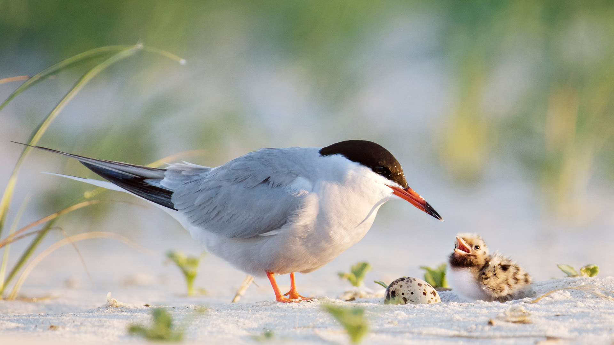
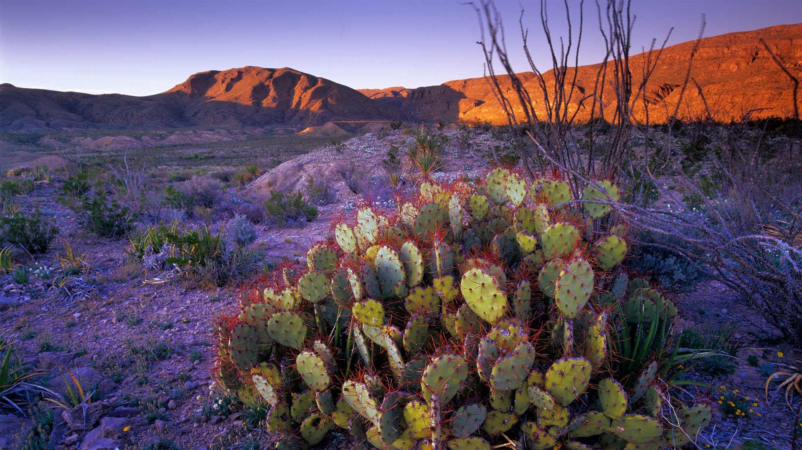
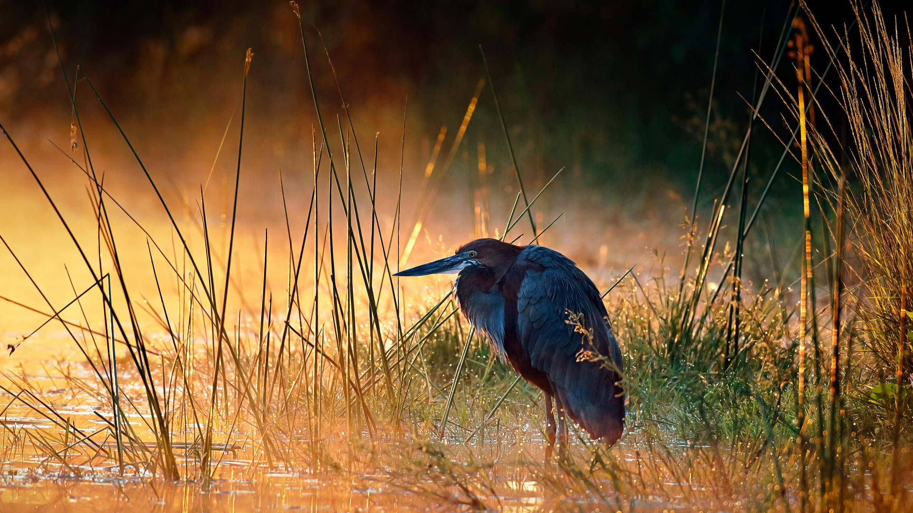
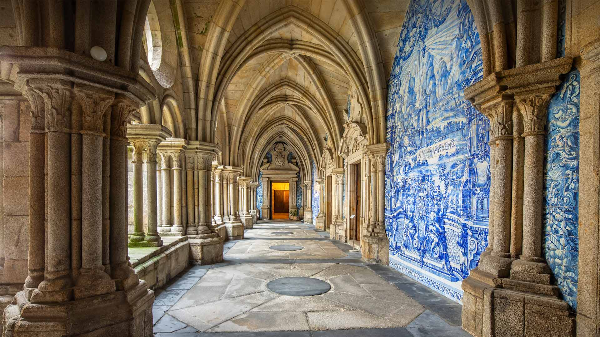

# Bing Wallpaper

```
Python 每日爬取Bing壁纸，保存到本地，同时将最近30天的图片链接写入README.md
从2009年开始至今的图片大部分都有，有几个实在是找不到了
```


## 今日图片


2023/07/04 [download](./images/2023/07/04/GrasslandsNationalParkSaskachewan_ZH-CN6530285883_1920x1080_2023-07-04.jpg)

## 最近30天的图片链接


|      |      |      |
| :----: | :----: | :----: |
|2023/07/04 [download](./images/2023/07/04/GrasslandsNationalParkSaskachewan_ZH-CN6530285883_1920x1080_2023-07-04.jpg)|2023/07/03 [download](./images/2023/07/03/CoyoteBanff_ZH-CN4183627255_1920x1080_2023-07-03.jpg)|2023/07/02 [download](./images/2023/07/02/HalfwayBoats_ZH-CN3563044251_1920x1080_2023-07-02.jpg)|
|2023/07/01 [download](./images/2023/07/01/RomeView_ZH-CN5882212305_1920x1080_2023-07-01.jpg)|2023/06/30 [download](./images/2023/06/30/ClamBears_ZH-CN5686721500_1920x1080_2023-06-30.jpg)|2023/06/29 [download](./images/2023/06/29/BanyakIslands_ZH-CN6620304821_1920x1080_2023-06-29.jpg)|
|2023/06/28 [download](./images/2023/06/28/ItalyCinqueTerre_ZH-CN6495965228_1920x1080_2023-06-28.jpg)|2023/06/27 [download](./images/2023/06/27/SedonaSunset_ZH-CN6289462383_1920x1080_2023-06-27.jpg)|2023/06/26 [download](./images/2023/06/26/VillandryGarden_ZH-CN6140359139_1920x1080_2023-06-26.jpg)|
|2023/06/25 [download](./images/2023/06/25/PetraTreasury_ZH-CN6007151900_1920x1080_2023-06-25.jpg)|2023/06/24 [download](./images/2023/06/24/NhaTrang_ZH-CN5834700560_1920x1080_2023-06-24.jpg)|2023/06/23 [download](./images/2023/06/23/PollinatorMonarch_ZH-CN5556988827_1920x1080_2023-06-23.jpg)|
|2023/06/22 [download](./images/2023/06/22/DragonBoatFestival2023_ZH-CN5255671687_1920x1080_2023-06-22.jpg)|2023/06/21 [download](./images/2023/06/21/SummerSolstice2023_ZH-CN5038619036_1920x1080_2023-06-21.jpg)|2023/06/20 [download](./images/2023/06/20/EagleTree_ZH-CN7775102951_1920x1080_2023-06-20.jpg)|
|2023/06/19 [download](./images/2023/06/19/Fawn_ZH-CN2172152960_1920x1080_2023-06-19.jpg)|2023/06/18 [download](./images/2023/06/18/TernFather_ZH-CN1860589914_1920x1080_2023-06-18.jpg)|2023/06/17 [download](./images/2023/06/17/SurfSanDiego_ZH-CN1485510748_1920x1080_2023-06-17.jpg)|
|2023/06/16 [download](./images/2023/06/16/HawksbillTurtle_ZH-CN0562063994_1920x1080_2023-06-16.jpg)|2023/06/15 [download](./images/2023/06/15/SmokyFireflies_ZH-CN3840923626_1920x1080_2023-06-15.jpg)|2023/06/14 [download](./images/2023/06/14/PassauSunsetJune_ZH-CN7563956674_1920x1080_2023-06-14.jpg)|
|2023/06/13 [download](./images/2023/06/13/OkefenokeeSwamp_ZH-CN3640203783_1920x1080_2023-06-13.jpg)|2023/06/12 [download](./images/2023/06/12/BigBendAnniv_ZH-CN3445097868_1920x1080_2023-06-12.jpg)|2023/06/11 [download](./images/2023/06/11/GoliathHeron_ZH-CN2413747227_1920x1080_2023-06-11.jpg)|
|2023/06/10 [download](./images/2023/06/10/PortugalDay_ZH-CN2939429166_1920x1080_2023-06-10.jpg)|2023/06/09 [download](./images/2023/06/09/BalloonsTurkey_ZH-CN2791109350_1920x1080_2023-06-09.jpg)|2023/06/08 [download](./images/2023/06/08/PlayfulHumpback_ZH-CN2241016258_1920x1080_2023-06-08.jpg)|
|2023/06/07 [download](./images/2023/06/07/ChacoCulture_ZH-CN2098865361_1920x1080_2023-06-07.jpg)|2023/06/06 [download](./images/2023/06/06/CliffsEtretat_ZH-CN1961838068_1920x1080_2023-06-06.jpg)|2023/06/05 [download](./images/2023/06/05/WaterfallsSunwaptaValley_ZH-CN1804229850_1920x1080_2023-06-05.jpg)|


