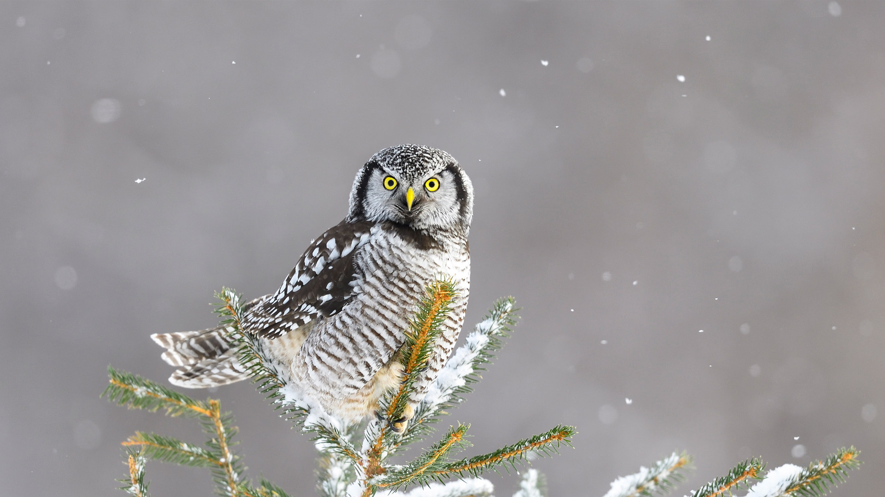
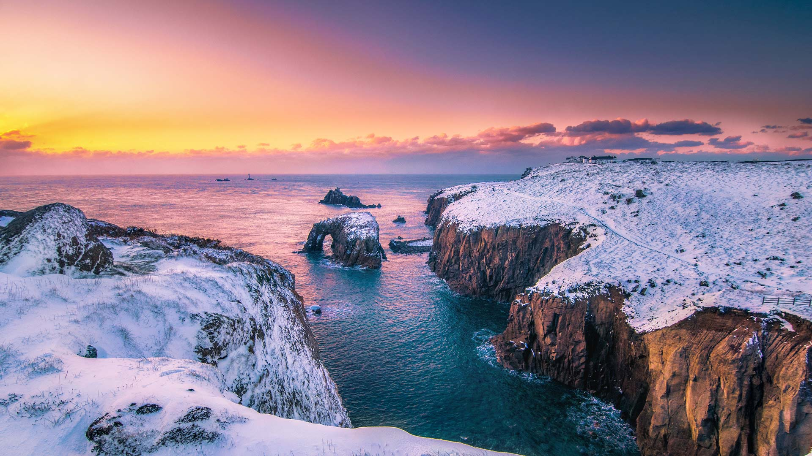
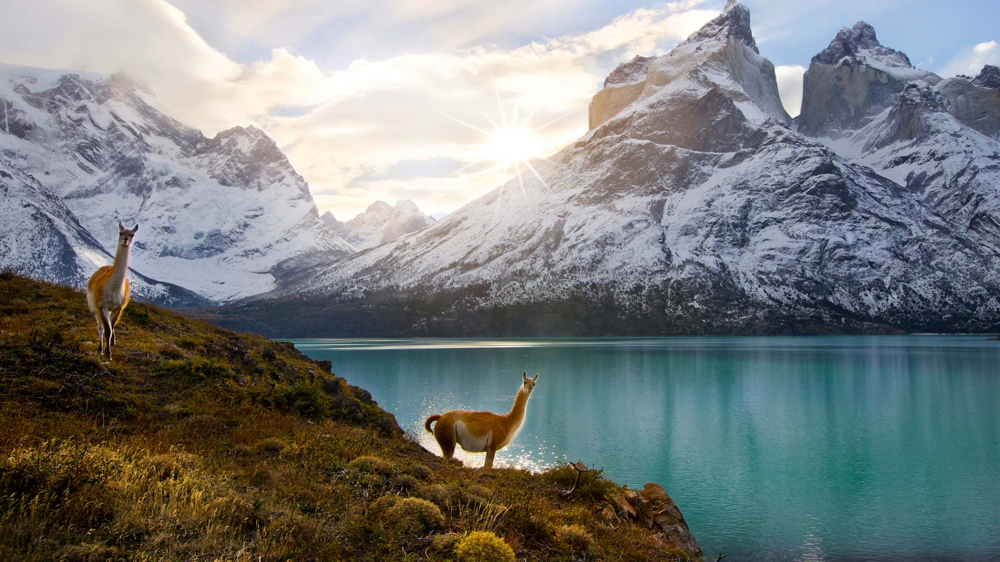

# Bing Wallpaper

```
Python 每日爬取Bing壁纸，保存到本地，同时将最近30天的图片链接写入README.md
从2009年开始至今的图片大部分都有，有几个实在是找不到了
```


## 今日图片


2024/12/19 [download](./images/2024/12/19/SibiuRomania_ZH-CN1631942857_1920x1080_2024-12-19.jpg)

## 最近30天的图片链接


|      |      |      |
| :----: | :----: | :----: |
|2024/12/19 [download](./images/2024/12/19/SibiuRomania_ZH-CN1631942857_1920x1080_2024-12-19.jpg)|2024/12/18 [download](./images/2024/12/18/MorningElephants_ZH-CN1418579765_1920x1080_2024-12-18.jpg)|2024/12/17 [download](./images/2024/12/17/ReinefjordenNorway_ZH-CN1198843758_1920x1080_2024-12-17.jpg)|
|2024/12/16 [download](./images/2024/12/16/SalzburgSnow_ZH-CN0964131994_1920x1080_2024-12-16.jpg)|2024/12/15 [download](./images/2024/12/15/MisurinaLake_ZH-CN0744434715_1920x1080_2024-12-15.jpg)|2024/12/14 [download](./images/2024/12/14/NorthernHawkOwl_ZH-CN8408027305_1920x1080_2024-12-14.jpg)|
|2024/12/13 [download](./images/2024/12/13/ChristmasBudapest_ZH-CN8197439971_1920x1080_2024-12-13.jpg)|2024/12/12 [download](./images/2024/12/12/WildPoinsettia_ZH-CN7984548709_1920x1080_2024-12-12.jpg)|2024/12/11 [download](./images/2024/12/11/DolomitesSky_ZH-CN9299967785_1920x1080_2024-12-11.jpg)|
|2024/12/10 [download](./images/2024/12/10/CornwallSnow_ZH-CN8407245245_1920x1080_2024-12-10.jpg)|2024/12/09 [download](./images/2024/12/09/GuanacosChile_ZH-CN7011761081_1920x1080_2024-12-09.jpg)|2024/12/08 [download](./images/2024/12/08/ReopeningNotreDame_ZH-CN6512133762_1920x1080_2024-12-08.jpg)|
|2024/12/07 [download](./images/2024/12/07/ArraialdoCabo_ZH-CN6202620711_1920x1080_2024-12-07.jpg)|2024/12/06 [download](./images/2024/12/06/GreaterSnow2024_ZH-CN5929129591_1920x1080_2024-12-06.jpg)|2024/12/05 [download](./images/2024/12/05/MonoTufa_ZH-CN4998806540_1920x1080_2024-12-05.jpg)|
|2024/12/04 [download](./images/2024/12/04/RhinosKenya_ZH-CN4422118541_1920x1080_2024-12-04.jpg)|2024/12/03 [download](./images/2024/12/03/JaipurFort_ZH-CN3891828158_1920x1080_2024-12-03.jpg)|2024/12/02 [download](./images/2024/12/02/SnowMoose_ZH-CN3364979952_1920x1080_2024-12-02.jpg)|
|2024/12/01 [download](./images/2024/12/01/IcebergsAntarctica_ZH-CN2942178295_1920x1080_2024-12-01.jpg)|2024/11/30 [download](./images/2024/11/30/KilchurnAutumn_ZH-CN2547959725_1920x1080_2024-11-30.jpg)|2024/11/29 [download](./images/2024/11/29/MtStMichel_ZH-CN1232662142_1920x1080_2024-11-29.jpg)|
|2024/11/28 [download](./images/2024/11/28/AssiniboineTS_ZH-CN9936042562_1920x1080_2024-11-28.jpg)|2024/11/27 [download](./images/2024/11/27/SemoisRiver_ZH-CN0801669014_1920x1080_2024-11-27.jpg)|2024/11/26 [download](./images/2024/11/26/TrulliGrove_ZH-CN9519400567_1920x1080_2024-11-26.jpg)|
|2024/11/25 [download](./images/2024/11/25/AmboseliGiraffes_ZH-CN9276085602_1920x1080_2024-11-25.jpg)|2024/11/24 [download](./images/2024/11/24/SonomaCoast_ZH-CN9187330701_1920x1080_2024-11-24.jpg)|2024/11/23 [download](./images/2024/11/23/FibonacciAloe_ZH-CN8974137481_1920x1080_2024-11-23.jpg)|
|2024/11/22 [download](./images/2024/11/22/ZafraCastle_ZH-CN8791148758_1920x1080_2024-11-22.jpg)|2024/11/21 [download](./images/2024/11/21/LionCubs_ZH-CN8538754038_1920x1080_2024-11-21.jpg)|2024/11/20 [download](./images/2024/11/20/PontBordeaux_ZH-CN7656263575_1920x1080_2024-11-20.jpg)|


