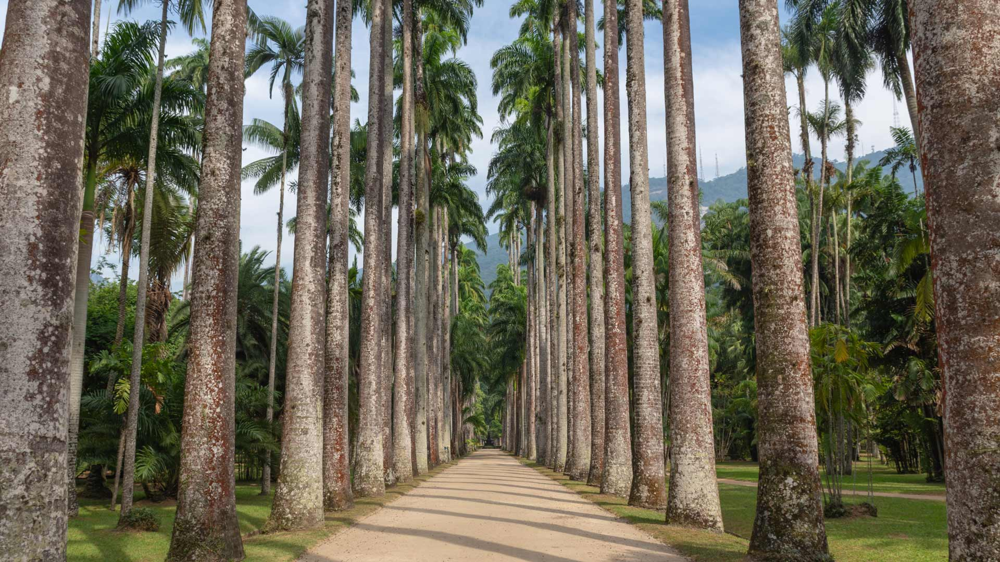
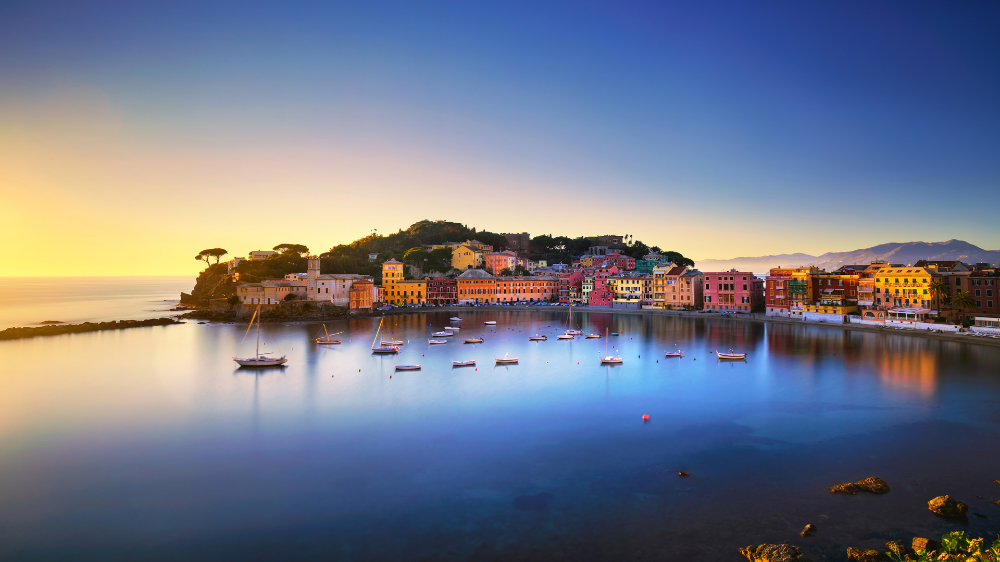
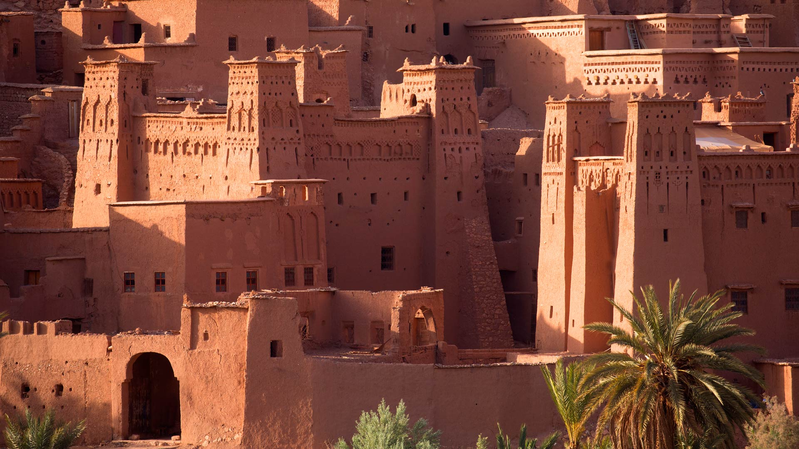
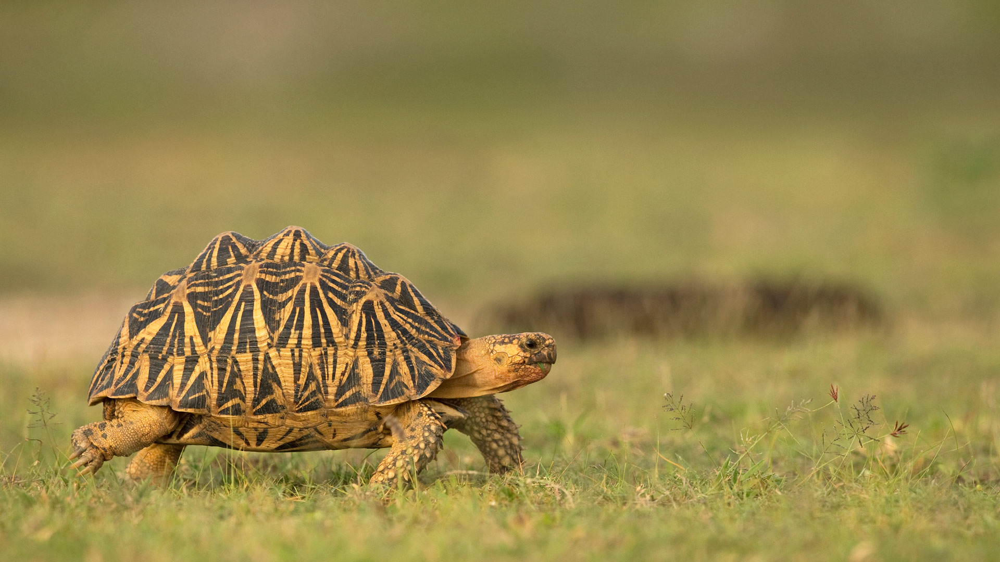
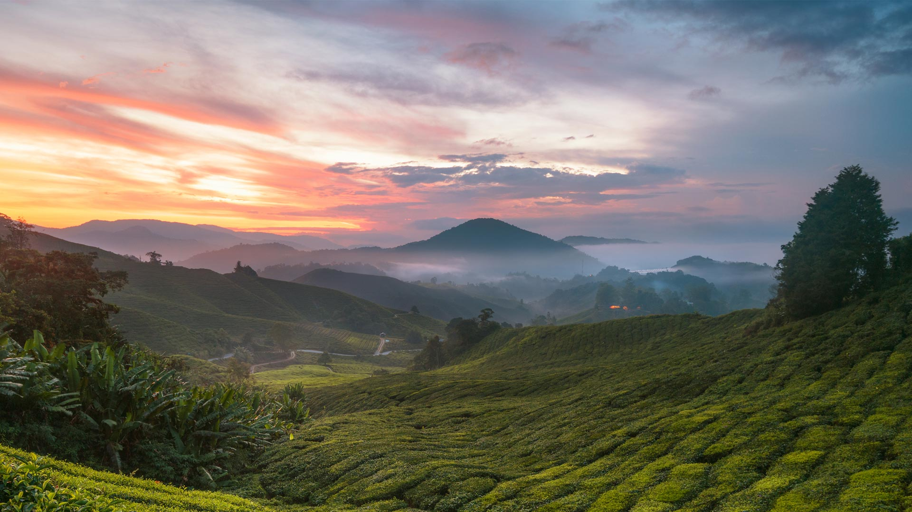
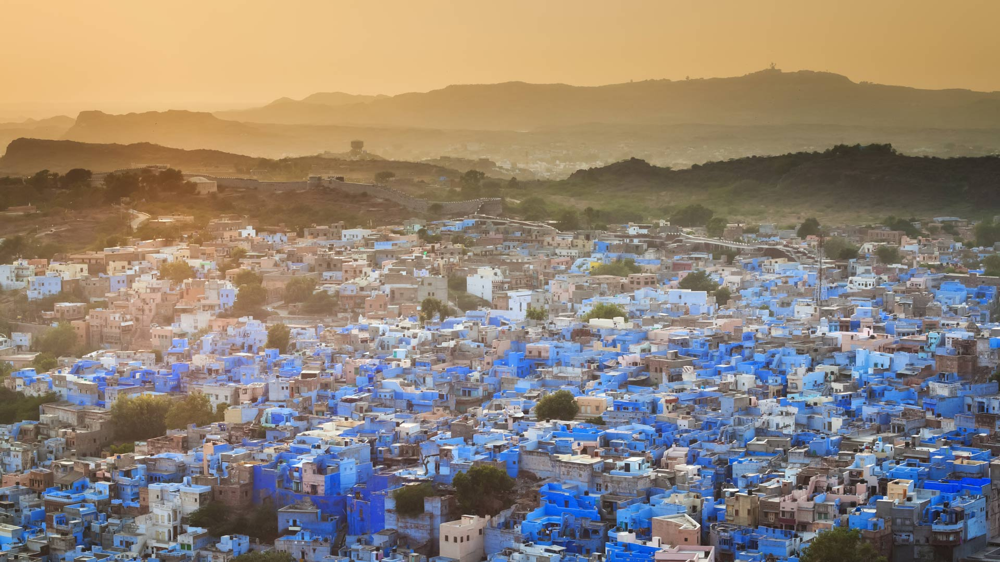
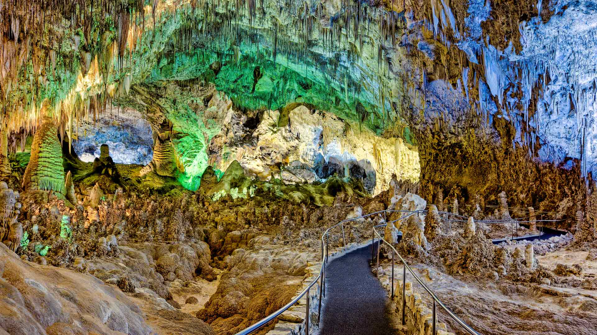

# Bing Wallpaper

```
Python 每日爬取Bing壁纸，保存到本地，同时将最近30天的图片链接写入README.md
从2009年开始至今的图片大部分都有，有几个实在是找不到了
```


## 今日图片


2024/06/09 [download](./images/2024/06/09/BardenasBiosphere_ZH-CN6198033700_1920x1080_2024-06-09.jpg)

## 最近30天的图片链接


|      |      |      |
| :----: | :----: | :----: |
|2024/06/09 [download](./images/2024/06/09/BardenasBiosphere_ZH-CN6198033700_1920x1080_2024-06-09.jpg)|2024/06/08 [download](./images/2024/06/08/KillikRiverAlaska_ZH-CN5736211272_1920x1080_2024-06-08.jpg)|2024/06/07 [download](./images/2024/06/07/HumpbackFamily_ZH-CN4336100531_1920x1080_2024-06-07.jpg)|
|2024/06/06 [download](./images/2024/06/06/CamargueFlamingos_ZH-CN4176922228_1920x1080_2024-06-06.jpg)|2024/06/05 [download](./images/2024/06/05/MadagascarRiver_ZH-CN3842472014_1920x1080_2024-06-05.jpg)|2024/06/04 [download](./images/2024/06/04/ChestnutBeeEater_ZH-CN3514753872_1920x1080_2024-06-04.jpg)|
|2024/06/03 [download](./images/2024/06/03/CopenhagenBicycles_ZH-CN3047958346_1920x1080_2024-06-03.jpg)|2024/06/02 [download](./images/2024/06/02/MenRuz_ZH-CN2021725181_1920x1080_2024-06-02.jpg)|2024/06/01 [download](./images/2024/06/01/CancaoDoExilio_ZH-CN1012675104_1920x1080_2024-06-01.jpg)|
|2024/05/31 [download](./images/2024/05/31/YorkshireDalesNP_ZH-CN0775378262_1920x1080_2024-05-31.jpg)|2024/05/30 [download](./images/2024/05/30/Everglades90th_ZH-CN9853372570_1920x1080_2024-05-30.jpg)|2024/05/29 [download](./images/2024/05/29/MullOtter_ZH-CN9691813587_1920x1080_2024-05-29.jpg)|
|2024/05/28 [download](./images/2024/05/28/MeteoraMonastery_ZH-CN9551991708_1920x1080_2024-05-28.jpg)|2024/05/27 [download](./images/2024/05/27/SestriLevante_ZH-CN9286254645_1920x1080_2024-05-27.jpg)|2024/05/26 [download](./images/2024/05/26/MethowWildflowers_ZH-CN8926661958_1920x1080_2024-05-26.jpg)|
|2024/05/25 [download](./images/2024/05/25/MoroccoBenhaddou_ZH-CN8742267428_1920x1080_2024-05-25.jpg)|2024/05/24 [download](./images/2024/05/24/OrdesaNationalPark_ZH-CN8545620273_1920x1080_2024-05-24.jpg)|2024/05/23 [download](./images/2024/05/23/IndianStarTortoise_ZH-CN7177478610_1920x1080_2024-05-23.jpg)|
|2024/05/22 [download](./images/2024/05/22/SnowGumTasmania_ZH-CN6975160884_1920x1080_2024-05-22.jpg)|2024/05/21 [download](./images/2024/05/21/MalaysiaTea_ZH-CN6758939415_1920x1080_2024-05-21.jpg)|2024/05/20 [download](./images/2024/05/20/HoneycombBee_ZH-CN6572760814_1920x1080_2024-05-20.jpg)|
|2024/05/19 [download](./images/2024/05/19/VernazzaItaly_ZH-CN6245826569_1920x1080_2024-05-19.jpg)|2024/05/18 [download](./images/2024/05/18/PacificRimNationalPark_ZH-CN5809123424_1920x1080_2024-05-18.jpg)|2024/05/17 [download](./images/2024/05/17/TarangireElephants_ZH-CN5447385839_1920x1080_2024-05-17.jpg)|
|2024/05/16 [download](./images/2024/05/16/ReconquistaVigo_ZH-CN4619580424_1920x1080_2024-05-16.jpg)|2024/05/15 [download](./images/2024/05/15/BlueCityIndia_ZH-CN4275229255_1920x1080_2024-05-15.jpg)|2024/05/14 [download](./images/2024/05/14/CarlsbadNP_ZH-CN4136753542_1920x1080_2024-05-14.jpg)|
|2024/05/13 [download](./images/2024/05/13/NamibiaCanyon_ZH-CN3973338246_1920x1080_2024-05-13.jpg)|2024/05/12 [download](./images/2024/05/12/GuanacoMother_ZH-CN3856540256_1920x1080_2024-05-12.jpg)|2024/05/11 [download](./images/2024/05/11/TexasIndigoBunting_ZH-CN3699392300_1920x1080_2024-05-11.jpg)|


