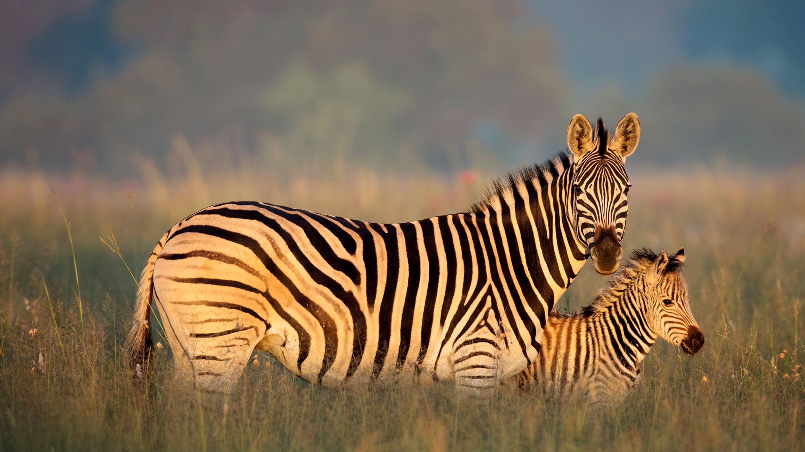
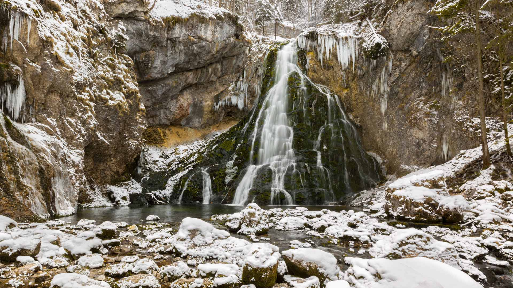
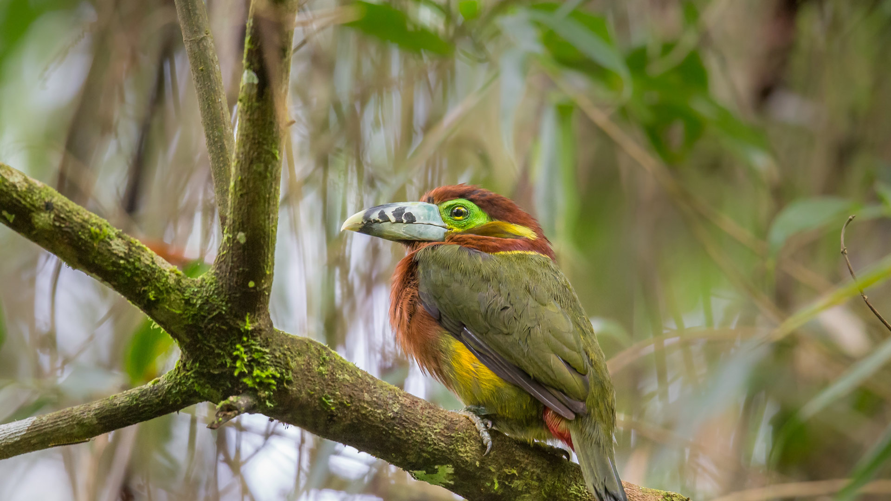
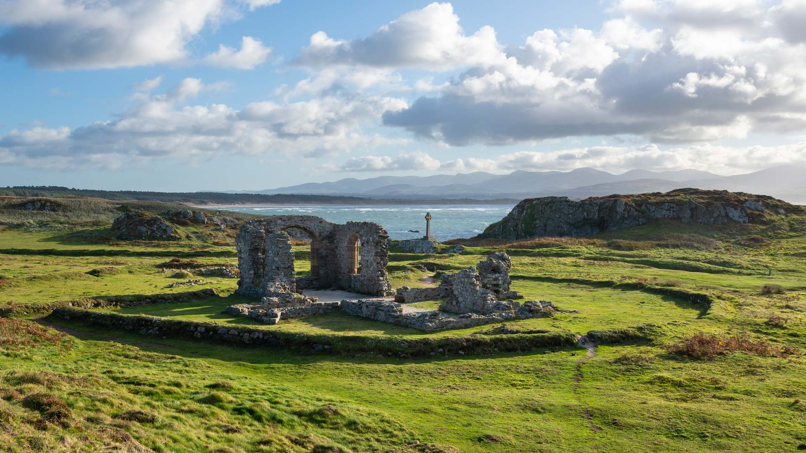
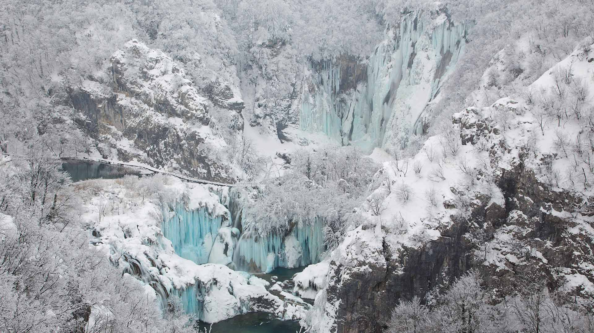
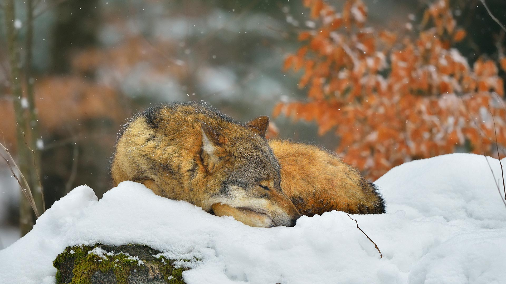
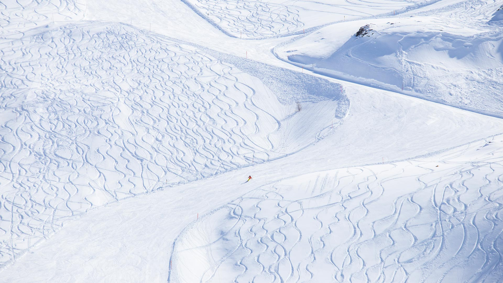
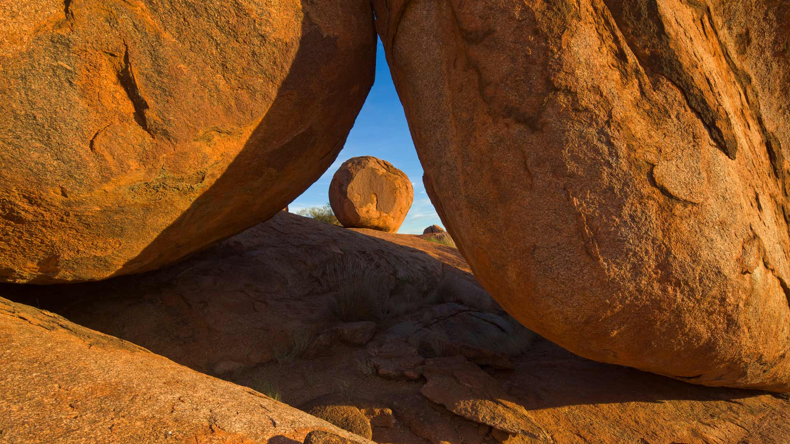
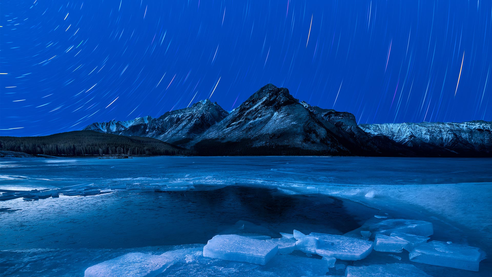

# Bing Wallpaper

```
Python 每日爬取Bing壁纸，保存到本地，同时将最近30天的图片链接写入README.md
从2009年开始至今的图片大部分都有，有几个实在是找不到了
```


## 今日图片


2024/02/01 [download](./images/2024/02/01/HalbinselJasmund_ZH-CN2110869056_1920x1080_2024-02-01.jpg)

## 最近30天的图片链接


|      |      |      |
| :----: | :----: | :----: |
|2024/02/01 [download](./images/2024/02/01/HalbinselJasmund_ZH-CN2110869056_1920x1080_2024-02-01.jpg)|2024/01/31 [download](./images/2024/01/31/ZebraMother_ZH-CN1947314869_1920x1080_2024-01-31.jpg)|2024/01/30 [download](./images/2024/01/30/AlbaceteSpain_ZH-CN1597281896_1920x1080_2024-01-30.jpg)|
|2024/01/29 [download](./images/2024/01/29/GollingerFalls_ZH-CN1137680822_1920x1080_2024-01-29.jpg)|2024/01/28 [download](./images/2024/01/28/ChannelOutback_ZH-CN0579687777_1920x1080_2024-01-28.jpg)|2024/01/27 [download](./images/2024/01/27/ToucanetEmpoleirado_ZH-CN8520861326_1920x1080_2024-01-27.jpg)|
|2024/01/26 [download](./images/2024/01/26/HawkOwl_ZH-CN3401920167_1920x1080_2024-01-26.jpg)|2024/01/25 [download](./images/2024/01/25/DwynwensDay_ZH-CN1768649253_1920x1080_2024-01-25.jpg)|2024/01/24 [download](./images/2024/01/24/IcelandBeach_ZH-CN1632329693_1920x1080_2024-01-24.jpg)|
|2024/01/23 [download](./images/2024/01/23/MaldivesAtolls_ZH-CN1365670653_1920x1080_2024-01-23.jpg)|2024/01/22 [download](./images/2024/01/22/SantaCruzSunrise_ZH-CN3074203377_1920x1080_2024-01-22.jpg)|2024/01/21 [download](./images/2024/01/21/SquirrelNetherlands_ZH-CN0757138587_1920x1080_2024-01-21.jpg)|
|2024/01/20 [download](./images/2024/01/20/MacaroniPenguins_ZH-CN0600867997_1920x1080_2024-01-20.jpg)|2024/01/19 [download](./images/2024/01/19/PlitviceWinter_ZH-CN0407572344_1920x1080_2024-01-19.jpg)|2024/01/18 [download](./images/2024/01/18/ParisBridge_ZH-CN0173421630_1920x1080_2024-01-18.jpg)|
|2024/01/17 [download](./images/2024/01/17/SleepyWolf_ZH-CN9870873990_1920x1080_2024-01-17.jpg)|2024/01/16 [download](./images/2024/01/16/LakeLouise_ZH-CN9592539152_1920x1080_2024-01-16.jpg)|2024/01/15 [download](./images/2024/01/15/IceChapel_ZH-CN9189733666_1920x1080_2024-01-15.jpg)|
|2024/01/14 [download](./images/2024/01/14/HokkaidoSwans_ZH-CN8733312972_1920x1080_2024-01-14.jpg)|2024/01/13 [download](./images/2024/01/13/HanaHighway_ZH-CN8601588011_1920x1080_2024-01-13.jpg)|2024/01/12 [download](./images/2024/01/12/BukhansanSeoul_ZH-CN8002920750_1920x1080_2024-01-12.jpg)|
|2024/01/11 [download](./images/2024/01/11/LynxSnow_ZH-CN8908082275_1920x1080_2024-01-11.jpg)|2024/01/10 [download](./images/2024/01/10/MilopotamosStairs_ZH-CN8013521384_1920x1080_2024-01-10.jpg)|2024/01/09 [download](./images/2024/01/09/BalloonDay_ZH-CN7571792218_1920x1080_2024-01-09.jpg)|
|2024/01/08 [download](./images/2024/01/08/BerninaPass_ZH-CN5776010452_1920x1080_2024-01-08.jpg)|2024/01/07 [download](./images/2024/01/07/DevilsMarbles_ZH-CN4897809914_1920x1080_2024-01-07.jpg)|2024/01/06 [download](./images/2024/01/06/CrabappleChaffinch_ZH-CN4458529756_1920x1080_2024-01-06.jpg)|
|2024/01/05 [download](./images/2024/01/05/AlpsReflecting_ZH-CN4036320440_1920x1080_2024-01-05.jpg)|2024/01/04 [download](./images/2024/01/04/GoldenGateLight_ZH-CN3874822904_1920x1080_2024-01-04.jpg)|2024/01/03 [download](./images/2024/01/03/MinnewankaLake_ZH-CN3020982568_1920x1080_2024-01-03.jpg)|


