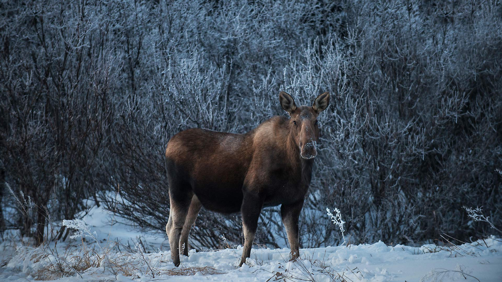
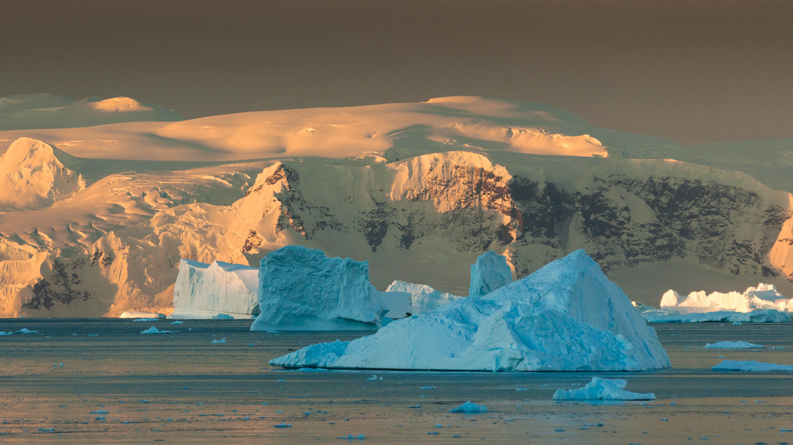
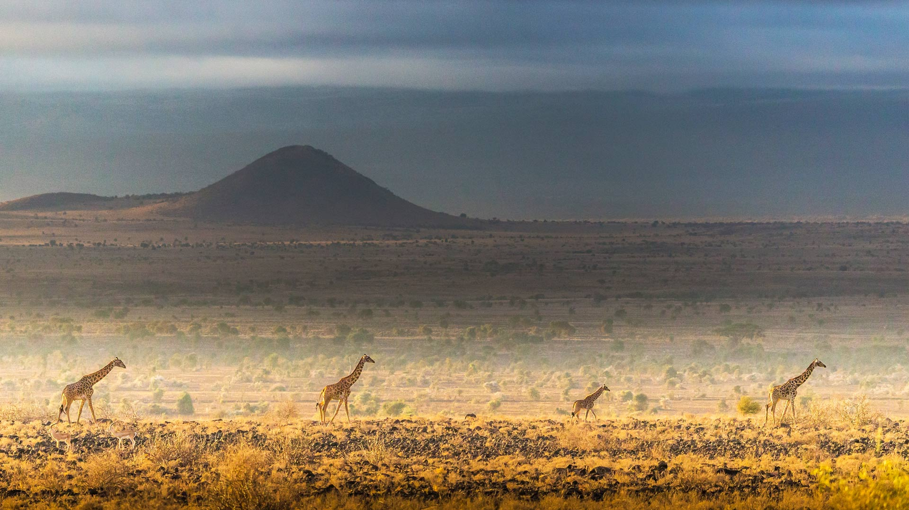
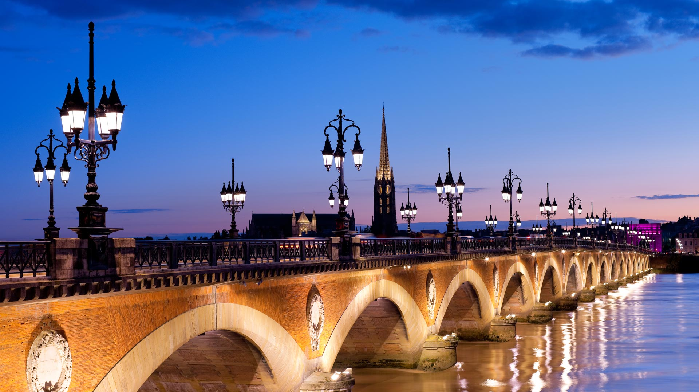
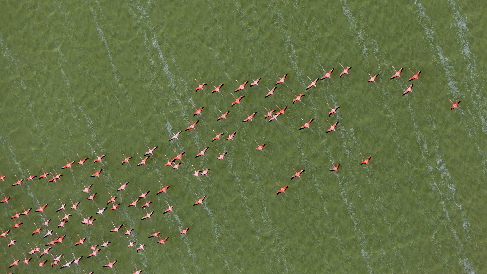
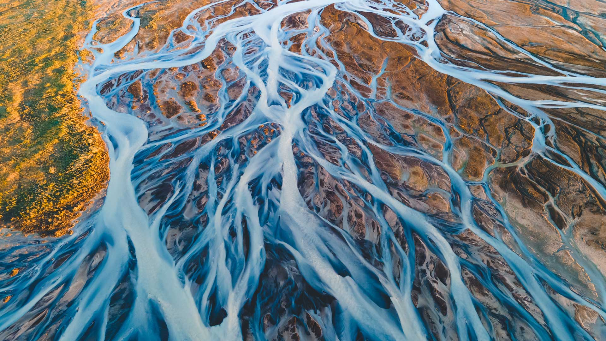

# Bing Wallpaper

```
Python 每日爬取Bing壁纸，保存到本地，同时将最近30天的图片链接写入README.md
从2009年开始至今的图片大部分都有，有几个实在是找不到了
```


## 今日图片


2024/12/03 [download](./images/2024/12/03/JaipurFort_ZH-CN3891828158_1920x1080_2024-12-03.jpg)

## 最近30天的图片链接


|      |      |      |
| :----: | :----: | :----: |
|2024/12/03 [download](./images/2024/12/03/JaipurFort_ZH-CN3891828158_1920x1080_2024-12-03.jpg)|2024/12/02 [download](./images/2024/12/02/SnowMoose_ZH-CN3364979952_1920x1080_2024-12-02.jpg)|2024/12/01 [download](./images/2024/12/01/IcebergsAntarctica_ZH-CN2942178295_1920x1080_2024-12-01.jpg)|
|2024/11/30 [download](./images/2024/11/30/KilchurnAutumn_ZH-CN2547959725_1920x1080_2024-11-30.jpg)|2024/11/29 [download](./images/2024/11/29/MtStMichel_ZH-CN1232662142_1920x1080_2024-11-29.jpg)|2024/11/28 [download](./images/2024/11/28/AssiniboineTS_ZH-CN9936042562_1920x1080_2024-11-28.jpg)|
|2024/11/27 [download](./images/2024/11/27/SemoisRiver_ZH-CN0801669014_1920x1080_2024-11-27.jpg)|2024/11/26 [download](./images/2024/11/26/TrulliGrove_ZH-CN9519400567_1920x1080_2024-11-26.jpg)|2024/11/25 [download](./images/2024/11/25/AmboseliGiraffes_ZH-CN9276085602_1920x1080_2024-11-25.jpg)|
|2024/11/24 [download](./images/2024/11/24/SonomaCoast_ZH-CN9187330701_1920x1080_2024-11-24.jpg)|2024/11/23 [download](./images/2024/11/23/FibonacciAloe_ZH-CN8974137481_1920x1080_2024-11-23.jpg)|2024/11/22 [download](./images/2024/11/22/ZafraCastle_ZH-CN8791148758_1920x1080_2024-11-22.jpg)|
|2024/11/21 [download](./images/2024/11/21/LionCubs_ZH-CN8538754038_1920x1080_2024-11-21.jpg)|2024/11/20 [download](./images/2024/11/20/PontBordeaux_ZH-CN7656263575_1920x1080_2024-11-20.jpg)|2024/11/19 [download](./images/2024/11/19/TasmansArch_ZH-CN7062784426_1920x1080_2024-11-19.jpg)|
|2024/11/18 [download](./images/2024/11/18/PorthcawlLighthouse_ZH-CN6655235820_1920x1080_2024-11-18.jpg)|2024/11/17 [download](./images/2024/11/17/RedStag_ZH-CN6403546321_1920x1080_2024-11-17.jpg)|2024/11/16 [download](./images/2024/11/16/FrieslandNetherlands_ZH-CN5952456898_1920x1080_2024-11-16.jpg)|
|2024/11/15 [download](./images/2024/11/15/YiPengLanterns_ZH-CN5613043353_1920x1080_2024-11-15.jpg)|2024/11/14 [download](./images/2024/11/14/ManarolaItaly_ZH-CN2837915120_1920x1080_2024-11-14.jpg)|2024/11/13 [download](./images/2024/11/13/KelpForest_ZH-CN2357269491_1920x1080_2024-11-13.jpg)|
|2024/11/12 [download](./images/2024/11/12/CoveArch_ZH-CN1281140578_1920x1080_2024-11-12.jpg)|2024/11/11 [download](./images/2024/11/11/Banff24_ZH-CN1156176817_1920x1080_2024-11-11.jpg)|2024/11/10 [download](./images/2024/11/10/YucatanFlamingos_ZH-CN0721673752_1920x1080_2024-11-10.jpg)|
|2024/11/09 [download](./images/2024/11/09/MoroccoMilkyWay_ZH-CN3544344290_1920x1080_2024-11-09.jpg)|2024/11/08 [download](./images/2024/11/08/GlacialRivers_ZH-CN0260507556_1920x1080_2024-11-08.jpg)|2024/11/07 [download](./images/2024/11/07/LiDong2024_ZH-CN9944723194_1920x1080_2024-11-07.jpg)|
|2024/11/06 [download](./images/2024/11/06/ShiShiBeach_ZH-CN8685799566_1920x1080_2024-11-06.jpg)|2024/11/05 [download](./images/2024/11/05/LencoisMaranhao_ZH-CN8194406488_1920x1080_2024-11-05.jpg)|2024/11/04 [download](./images/2024/11/04/CumbriaAutumn_ZH-CN7697251216_1920x1080_2024-11-04.jpg)|


